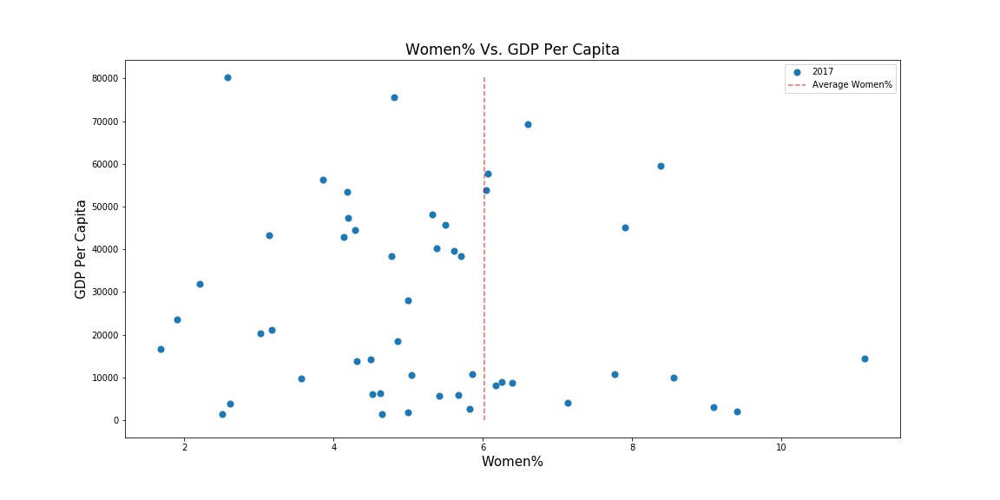
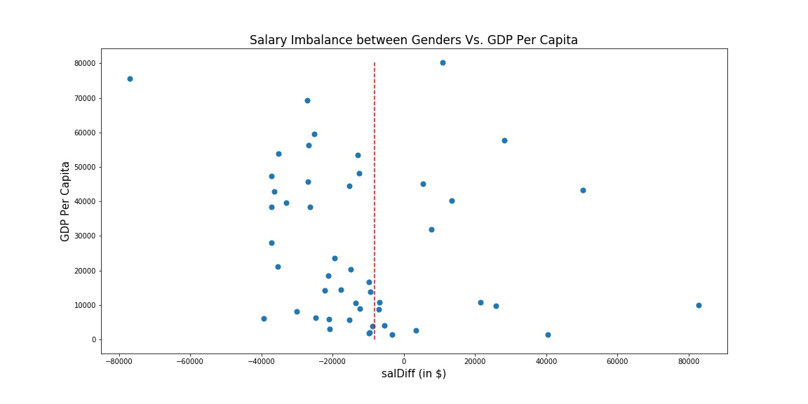
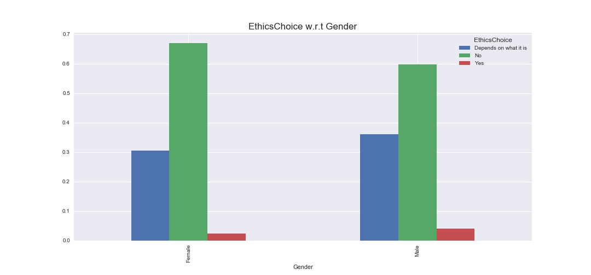

# Stackoverflow'18 Survey Analysis - A deeper look into gender inequalities.

## Motivation
 The project is motivated to have a deeper look at the gender inequalities that exists specifically in the tech space. For this purpose, Stackoverflow's 2018 survey results are deeply analyzed. Although, may not be completely scientific, the analysis is aimed to have some understanding at the magnitude of inequalities between genders, and how they relate to economic factors of the country, if any. 

 **Medium Blog Post: ** https://medium.com/@chalam.pusuluri/gender-inequality-in-tech-space-a-deeper-analysis-483109dc4533?source=friends_link&sk=f4b58fa2b331e8f601e4420ad94098db

## Requirements: 
- Python 3.5 or higher 
- Matplotlib
- Pandas

Note: all of the requirements come right out of the box once you install ([Anaconda](https://www.anaconda.com/download/#macos)) into your machine. 

## Repository break-down:
- StackOverflow'18 Analysis.ipynb (A Jupyter Notebook containing all the detailed code and comments for the analysis)
- images (a folder where all the images are stored)
- developer_survey_2018 (a folder that hosts all the required csv files)

## Summary of the Analysis

Specifically, we tried to answer the below given questions in the analysis:

**Question 1:** How does the gender imbalance vary with respect to countries? 

**Findings**: 
- The overall female representation is a mere ~6%
- Egypt, Argentian and Nigeria have the best female representation, and Italy, Slovenia and Lithuania the worst.
- Interestingly, there is no relation between GDP Per Capita and the percentage of women represented in the survey.

** Question 2:** How does salary vary across contries between genders?

**Findings**: 
    
- The overall (mean) salary imbalance stood at ~ $8200
- Malaysia, Belgium and Pakistan have the highest (positive) salary difference between female and male respondents, and Norway, South Africa and Austria the highest (negative) difference.
- Interestingly, there is no relation between GDP Per Capita and the salary difference between genders.

** Question 3:** How does ethical choices vary across genders? 

**Findings:**

- Males are more inclined to make unethical choices - almost twice as much as female percentage who would make this choice. Male - 4%, Female - 2.3%. However, overall, very few respondents said they would make unethical choices. 
- There is a significant difference in the percentage of respondents who would strongly stick to ethical standards between males and females (59% Male Vs. 67% Female).
- More percentage of males than females (36% Male vs. 30% Female) said their ethical choices "Depends on what (kind of unethical purpose/product) it is" before they make an ethical choice.

** Plots **

## Acknowledgements and Data Sources:

- [The World Bank Data on GDP Per Capita for 2017](https://data.worldbank.org/indicator/ny.gdp.pcap.cd)
- [Stackoverflow Annual Developer Survery for 2018](https://insights.stackoverflow.com/survey)

## License

MIT License

Copyright (c) 2018 Uirá Caiado

Permission is hereby granted, free of charge, to any person obtaining a copy
of this software and associated documentation files (the "Software"), to deal
in the Software without restriction, including without limitation the rights
to use, copy, modify, merge, publish, distribute, sublicense, and/or sell
copies of the Software, and to permit persons to whom the Software is
furnished to do so, subject to the following conditions:

The above copyright notice and this permission notice shall be included in all
copies or substantial portions of the Software.

THE SOFTWARE IS PROVIDED "AS IS", WITHOUT WARRANTY OF ANY KIND, EXPRESS OR
IMPLIED, INCLUDING BUT NOT LIMITED TO THE WARRANTIES OF MERCHANTABILITY,
FITNESS FOR A PARTICULAR PURPOSE AND NONINFRINGEMENT. IN NO EVENT SHALL THE
AUTHORS OR COPYRIGHT HOLDERS BE LIABLE FOR ANY CLAIM, DAMAGES OR OTHER
LIABILITY, WHETHER IN AN ACTION OF CONTRACT, TORT OR OTHERWISE, ARISING FROM,
OUT OF OR IN CONNECTION WITH THE SOFTWARE OR THE USE OR OTHER DEALINGS IN THE
SOFTWARE.
 a summary of the results of the analysis, and necessary acknowledgements.